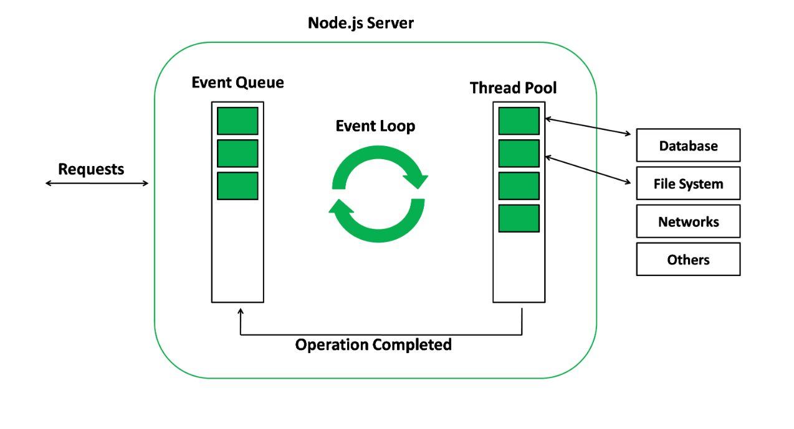

按照[官方介绍](https://nodejs.dev/en/learn/)，通过5个要点来讲解Node.js是什么，具体如下。

## 1、JavaScript运行时环境

Node.js 是一个开源和跨平台的 JavaScript 运行时环境。 它是几乎任何类型项目的流行工具！Node.js 具有独特的优势，因为数百万为浏览器编写 JavaScript 的前端开发者现在除了客户端代码之外，还能够编写服务器端代码，而无需学习完全不同的语言。

这里需要说明的是，JavaScript优先，但也支持C/C++/Rust，通过N-Api（之前叫Nan node addon）扩展即可。

Node.js主要场景是服务器端代码，却在前端工程领域无心插柳柳成荫，变成了大前端领域必备的组成部分。下面讲Node.js应用场景的时候会细讲。

## 2、基于v8，所以快

Node.js 在浏览器之外运行 V8 JavaScript 引擎（Google Chrome 的内核）。 这使得 Node.js 执行速度非常高效。

很多c代码写的算法，都不一定比v8写的js代码执行速度快。参考https://github.com/felixge/faster-than-c

## 3、单进程单线程，简单

Node.js 应用在单个进程中运行，无需为每个请求创建新线程。 Node.js 在其标准库中提供了一组异步 I/O ，以防止 JavaScript 代码阻塞，并且通常Node.js 中的库是使用非阻塞范例编写的，这使得阻塞行为成为异常而不是常态。

缺点：部署服务端代码的时候，一般你需要根据多少个cpu核数n来决定起n-1个实例，这时候就需要pm2这样的进程管理工具，很多人人吐槽pm2，其根本原因是Node.js自身机制问题。

## 4、基于libuv实现的事件循环，成败皆因此

当 Node.js 执行 I/O 操作时，如从网络读取、访问数据库或文件系统，Node.js 不会阻塞线程和浪费 CPU 周期等待，而是会在事件循环完成恢复操作。

当Node.js进程启动时，Node会创建一个类似于`while(true){...}`的EventLoop（浏览器也有），每执行一次循环体的过程，我们称为`Tick`。每个`Tick`的过程就是查看是否有事件待处理，如果有，就取事件及其相关的回调函数。如果存在关联的回调函数，就执行他们。然后进入下一个循环，如果不再有事件要处理，就退出进程。以后学的深入的时候，需要setImmediate 和 process.nextTick，就是围绕EventLoop操作的相关API。

这使得 Node.js 可以使用单个服务器处理数千个并发连接，而不会引入管理线程并发的负担（这可能是灾难的来源）。

基于EventLoop，任务是异步的，所以要采用Error-first Callback写法，所以导致后面异步流程极其复杂，且编写代码时，需要时刻注意EventLoop里加入的代码是否为异步，不然就可能出现性能问题。

辩证的看，Node.js的好处是让你不需要关注多线程就能实现高性能，但你需要关注事件循环是否为异步。

果然，天下没有免费的午餐。

## 5、跟进Web标准

在 Node.js 中，可以毫无问题地使用新的 ECMAScript 标准（部分），因为你不必等待所有用户更新他们的浏览器（但要等v8更新） - 你负责通过更改 Node.js 版本来决定使用哪个 ECMAScript 版本（这其实不是特性，而是不完善）， 你还可以通过运行带有标志的 Node.js 来启用特定的实验性特性（这种一般就是玩玩）。

说的有点夸张了，但跟进是事实，且一定是有滞后现象的。