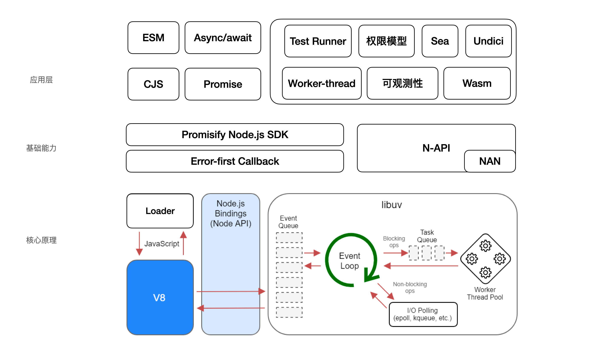

讲Node.js应用场景的时候，我们说过占比较大的前端相关场景，除了Server、API，其他基本都算是大前端场景的组成部分。

下面我们来看一下Node.js和大前端的关系。

Node.js在大前端中发挥了重要作用，主要包括以下方面：

1. 服务器端开发：Node.js可以作为服务器端语言来处理HTTP请求，实现服务器端的逻辑处理和数据存储等功能。
2. 前端构建工具：Node.js提供了npm包管理工具，开发者可以通过npm下载和管理各种前端框架、库和插件等。
3. 前端自动化构建：Node.js可以结合gulp、grunt、webpack、vite等自动化构建工具来进行前端代码的自动化打包、压缩、合并等操作，提高开发效率。
4. 实时通信：Node.js可以通过socket.io等技术实现实时通信，例如聊天室、在线游戏等，比如hmr等。
5. 数据库操作：Node.js可以通过mongoose等库来进行数据库的操作，例如数据的增删改查等。
6. 人工智能：Node.js可以结合TensorFlow等机器学习框架来进行人工智能的开发和应用。
7. 云计算：Node.js可以结合AWS Lambda等云计算平台来进行云计算相关的开发和应用。

总之，Node.js在大前端中的应用非常广泛，可以帮助开发者快速搭建服务器、构建前端、实现自动化构建、进行实时通信、操作数据库、开发人工智能等。
