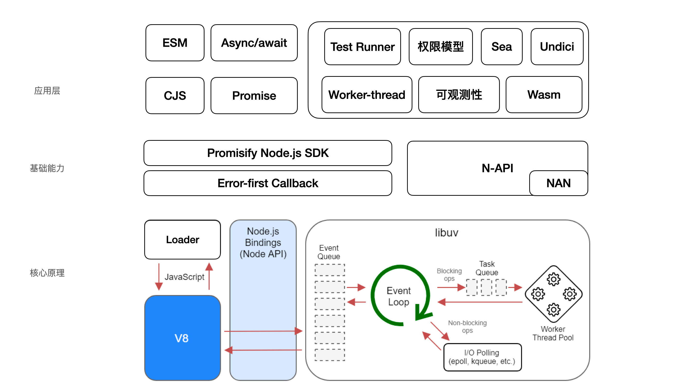

- node v20特性：std lib 在标准化，user lib 在精细化
    - v8+eventloop+promise-base api（error-first）+event
    - npm
    - esm
    - async/await + promise
    - worker thead（tinypool）
    - loader
    - test runner
    - 权限模型
    - 可观测性，包括 logging/metrics/tracing，以及 APM 等
    - 现代化的 HTTP：undici
    - wasm
    - n-api

本节主要讲解Node.js v20入门，大家了解一下即可，限于篇幅，下一门课会详细讲具体细节。